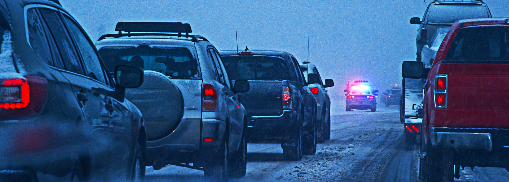

# Analysis of Road Accidents in Key UK Cities: Insights and Recommendations

 

## Introduction

As a data analyst, I was recently assigned the task of creating a top-level dashboard for road accidents in key UK cities. The primary objective was to analyze and derive insights to answer crucial questions and help stakeholders make informed data driven decisions in order to reduce and eventually prevent road accidents within these major cities. Through extensive analysis of road accident data in year 2021 and 2022, I uncovered several key observations that can guide future decision-making. In this post, I will share my findings and provide recommendations based on the insights derived from the road accident report and dashboard.

## Business Problem:
Improving Road Safety Measures to Prevent Accidents
The objective of this analysis was to answer critical questions and help agency stakeholders gain a deeper understanding of the accident occurrences. 
After several meetings with various stakeholders and departments within my company, I was able to gather the following specific requirements.

1)	Primary KPI - Total Casualties and Total Accident values for Current Year and YoY growth
2)	Primary KPI’s - Total Casualties by Accident Severity for Current Year and YoY growth
3)	Secondary KPI’s – Total Casualties with respect to vehicle type for Current Year
4)	Monthly trend showing comparison of casualties for Current Year and Previous Year
5)	Casualties by Road Type for Current Year
6)	Current Year Casualties by Area/Location & by Day/Night
7)	Total Casualties and Total Accidents by Location

## Stakeholders

-	Ministry of Transport
-	Road Transport Department
-	Police Force
-	Emergency Services Department
-	Road Safety Corps
-	Transport Operators
-	Traffic Management Agencies
-	Public
-	Media

## Skills/Concepts Demonstrated

-	Connecting to raw data or flat file
-	Data Cleaning in Power Query
-	Data Processing
-	Time Intelligence Function/ Calendar Date Table in Power BI
-	Data Modeling (Relationship between multiple tables)
-	YTD and YoY Growth Calculations using DAX
-	KPI and Advanced KPI Generations
-	Creating custom columns and measures in the reports
-	Importing images
-	Creating different charts and generating insights
-	Export the report to users
-	Creating Dashboards

## Observations and Insights

1.	Casualties by Vehicle Type Analysis:
The major cause of casualties on the roads are cars followed by vans and bikes. Cars caused more than half of casualties (almost 80%). Both vans and bikes caused 8% of casualties. This highlights the significant impact and involvement of cars in road accidents. It is crucial to address factors such as driver behavior, road infrastructure, and vehicle safety measures to mitigate the risks associated with car accidents.

    

2.  Casualties by Road Type Analysis:
The major cause of casualties by road type is caused by single carriageway. This caused over 70% of casualties. Both dual carriageway and roundabout caused about 6% of casualties. This indicates that single carriageway roads pose a significant risk to road users and require attention in terms of safety improvements and accident prevention measures.
Understanding the specific factors contributing to accidents on dual carriageway and roundabouts can also inform targeted interventions.

    

3.	Casualties by Urban/Rural Analysis:
More than 50% of casualties happened in the Urban areas as compared to 38% in the rural areas. This suggests that urban areas pose a higher risk for road accidents and require increased attention to improve road safety measures. Factors such as higher population density, increased traffic volume, complex road networks, and various modes of transportation interacting in urban environments may be contributing to the higher casualty rate.

   

4.	Casualties by Light Conditions Analysis:
More than 70% of accidents happened during the daytime as compared to 26% at night. This suggests that the risk of accidents is higher when visibility conditions are generally better. Factors such as increased traffic volume, higher speeds, driver fatigue, and distractions during the day may contribute to the higher occurrence of accidents.
While the percentage of accidents at night is lower, around 26%, it still represents a notable portion of the total. Nighttime driving poses its own set of challenges, including reduced visibility, driver impairment, and increased difficulty in perceiving hazards. Therefore, it is important to address factors specific to nighttime driving, such as improving street lighting, promoting driver awareness of nighttime hazards, and enforcing regulations related to impaired driving and visibility-enhancing measures.

## Visualizations (Report and Dashboard)

The report comprises of a page with two slicers and diverse visuals that interact with each other. 

You can interact with the report [here](https://app.powerbi.com/links/pccHKcXIRj?ctid=3327555b-876a-470a-b0cf-ded3db22f2b5&pbi_source=linkShare)

## Recommendations for Agency:

Based on the data analysis report outlining the results, here are some recommendations for stakeholders:
1. Improve Road Safety Measures for Cars: 

Given that over 50% of casualties were caused by cars, it is essential to focus on improving road safety measures specifically targeting car-related accidents. This could include initiatives such as raising awareness about safe driving practices, enforcing stricter traffic regulations, and implementing technology-based solutions like advanced driver assistance systems (ADAS) to mitigate risks associated with car accidents. Stakeholders should collaborate with relevant authorities, law enforcement agencies, and automotive manufacturers to implement effective measures to reduce car-related casualties.

2. Enhance Safety Measures on Single Carriageways: 

Since the majority of accidents (more than 70%) occurred on single carriageways, it is crucial to prioritize the enhancement of safety measures on these road types. Stakeholders should consider investing in infrastructure improvements, such as widening roads, adding safety barriers, improving road signage, and implementing effective traffic calming measures. Additionally, promoting driver education and awareness programs specific to single carriageways can help reduce accidents in these areas. By addressing the unique challenges associated with single carriageways, stakeholders can significantly improve road safety.

3. Focus on Urban Areas: 

With almost 60% of accidents happening in urban areas, it is evident that specific attention should be given to improving safety in these locations. Stakeholders should consider implementing measures such as enhanced traffic management systems, pedestrian safety initiatives, improved infrastructure for cyclists, and the creation of pedestrian-friendly zones. Collaborating with local government bodies, urban planners, and community organizations can help identify and address the specific factors contributing to accidents in urban areas, thus reducing the overall number of incidents.

4. Daytime Safety Measures: 

Since over 70% of accidents occurred during the day, stakeholders should focus on improving safety measures during daylight hours. This may include campaigns to raise awareness about safe driving practices, highlighting the importance of vigilance and alertness even in familiar surroundings. Furthermore, stakeholders can consider conducting targeted educational programs and driver training initiatives to address common causes of daytime accidents, such as distracted driving or speeding.

## Conclusion
It is important for stakeholders to collaborate with relevant government agencies, law enforcement, community organizations, and other stakeholders to implement these recommendations effectively. Regular monitoring and evaluation of implemented measures will be critical to assess their impact on reducing accidents and casualties. By prioritizing these recommendations, stakeholders can make significant strides towards improving road safety and preventing accidents in the identified areas of concern.

